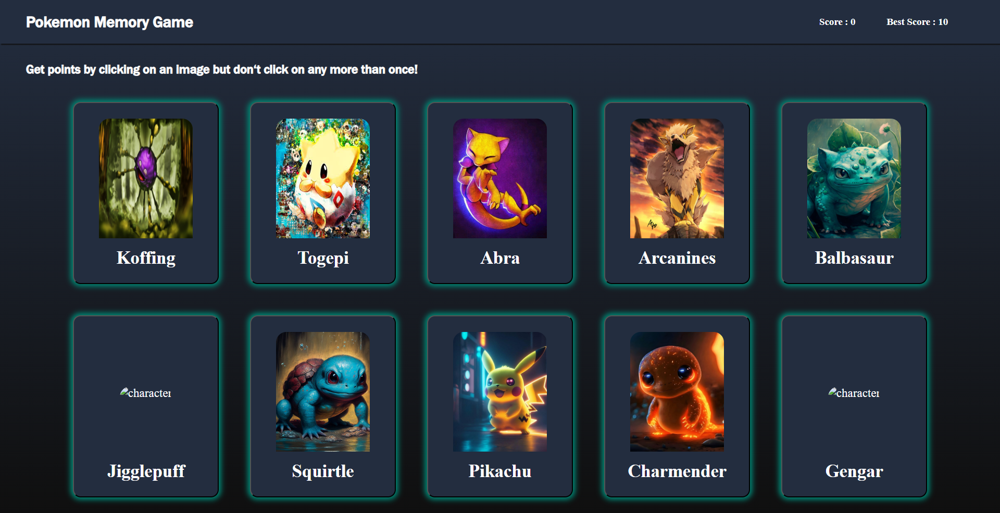

# 🧠 Memory Card Game

**Memory Card** is a simple yet engaging web-based memory game built with React and Vite. The goal is to click each of the 10 unique cards only once. If you click the same card twice, you lose the game. Try to achieve the highest possible score of 10! 

---

## 🎯 Game Rules

- 🎴 There are 10 cards displayed
- ✅ You must click each card only once
- ❌ Clicking the same card twice ends the game
- 🏆 Max score: **10**

---

## 🚀 Features

- 🧠 **Challenging Memory Logic**
  - Tests your memory with randomized cards
- 🔄 **Shuffling Mechanism**
  - Cards are shuffled after each valid click
- 📈 **Score Tracking**
  - Displays current and best score
- ⚡ **High Performance**
  - Built with Vite for fast development experience

---

## 🛠️ Tech Stack

| Layer         | Technologies                |
|---------------|-----------------------------|
| Frontend      | React, Vite, CSS            |
| Tools         | Git, GitHub, VS Code        |

---


###  Home Page



---
## 📦 Getting Started

Clone the repository and start the development server:

```bash
git clone https://github.com/kuyucucaner/Memory-Card.git
cd Memory-Card
npm install
npm run dev
